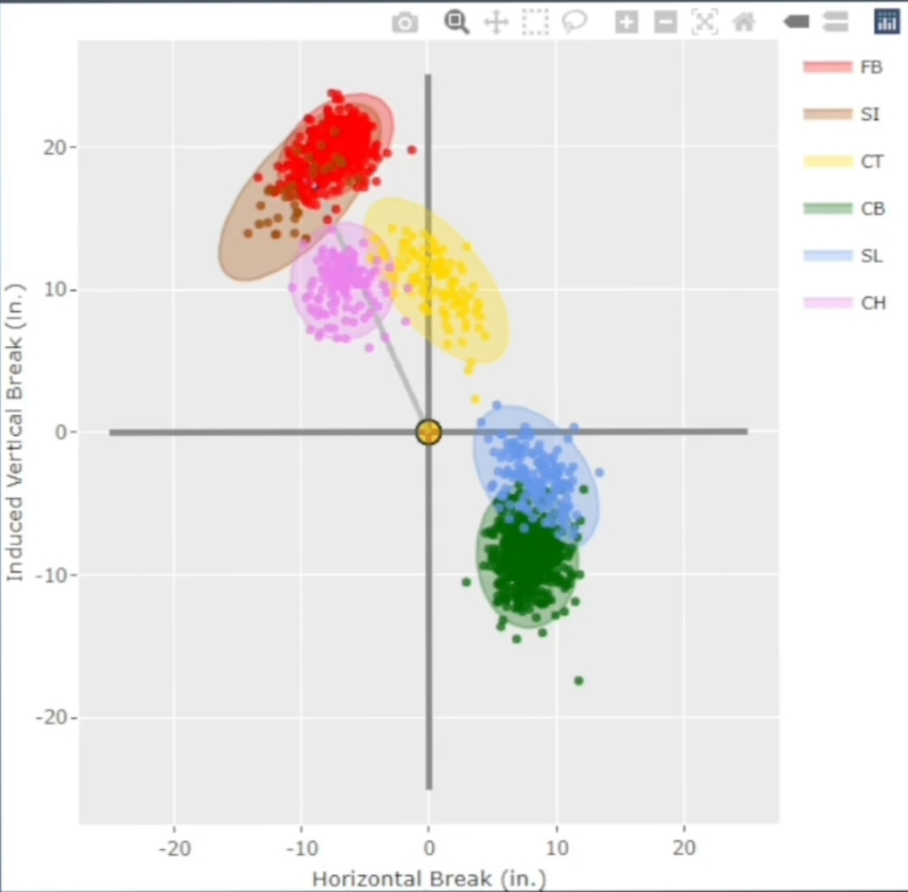
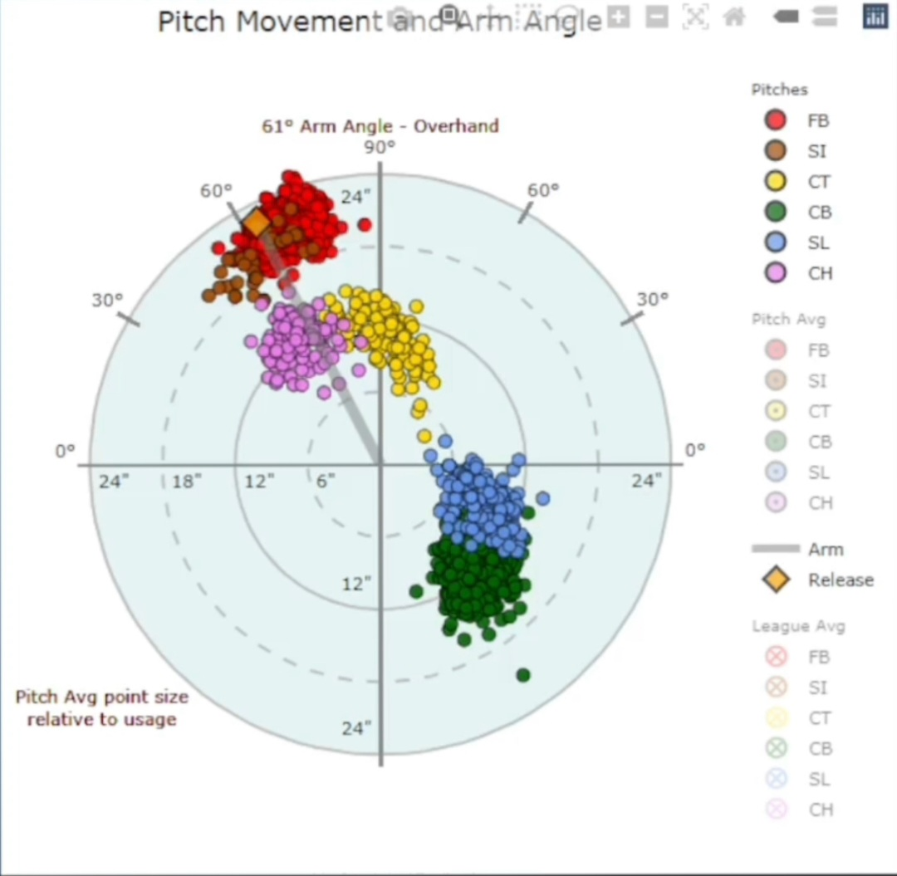
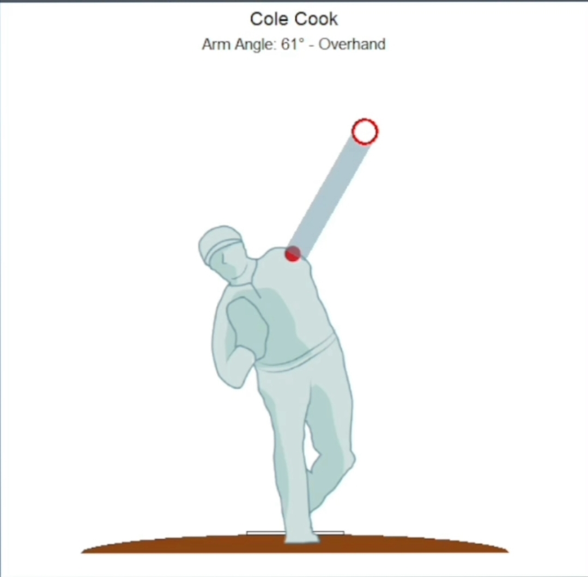

# Frontier League Arm Angles

This repo works to infer arm angles for Frontier League pitchers using their height, release height, and release side using Yakkertech data. The [original analysis](https://github.com/trevorwthrash/armAngles) was done in python by Github user [Trevor Thrash](https://github.com/trevorwthrash/armAngles). This is my attempt at recreating his methodology in R and creating different plots in ggplot and plotly. 

The code will calculate 3 different arm angles, but they will be plotted all the same on the plots. For example, following Trevor's work, his arm angles had set 90° as sidearm and 0° as straight over the top. Savanat has it calculated the opposite way with 90° being over the top and 0° being sidearm. I also included arm_angle_180 where 180° is equal to savant's 90° over the top measurement. Using arm_angle_180 allows you to plot a pitch's spin axis (0-360) and a pitcher's arm angle on the same plot.

Example of the 3 arm angle measurements in the plots below:
arm_angle = 29°
arm_angle_savant = 61° (which is the measurement used in the plot)
arm_angle_180 = 151°

## Example Plots

### Cole Cook Movement Plot

### Cole Cook Savant Plot

### Cole Cook Arm Angle Plot

One issue is the reliability and accuracy of Yakkertech data. There are a lot of pitches where release heights are over 8 feet (up to 50 feet) and below 1 foot (fdr non submarine pitchers. Relesase sides and extension also have these inaccuracies. 
